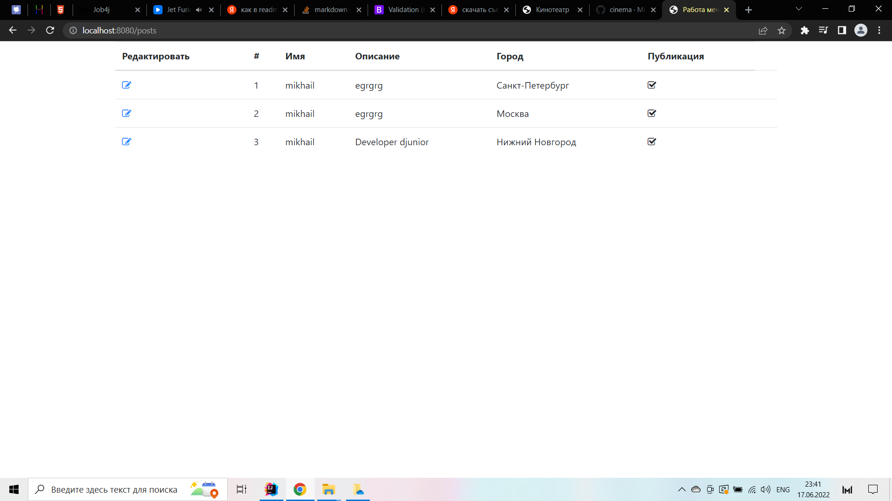

В этом блоке мы поговорим о создании веб приложений на языка Java.

Мы будем использовать Spring boot, как основную библиотеку, но рассматривать детали этого фреймворка не будем. Это будет в блоке Spring.

Основная задача этого блока, понять архитектуру веб приложений.

Мы будем разрабатывать приложение "Работа мечты".

Для работы с этим блоком Вам нужно поставить Ultimate IDEA. Учебные ключи можно получить у Арсентьева Петра.

В системе будут две модели: вакансии и кандидаты. Кандидаты будут публиковать резюме. Кадровики будут публиковать вакансии о работе.

Кандидаты могут откликнуться на вакансию. Кадровик может пригласить на вакансию кандидата.

